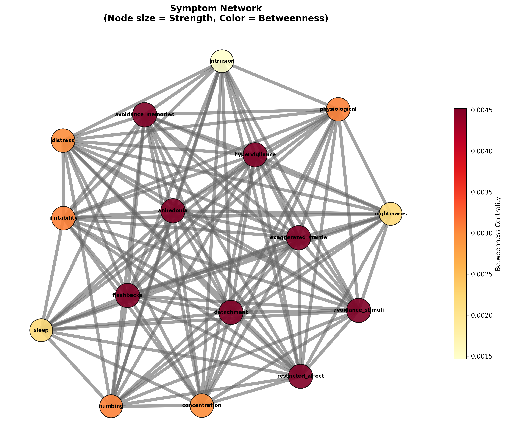
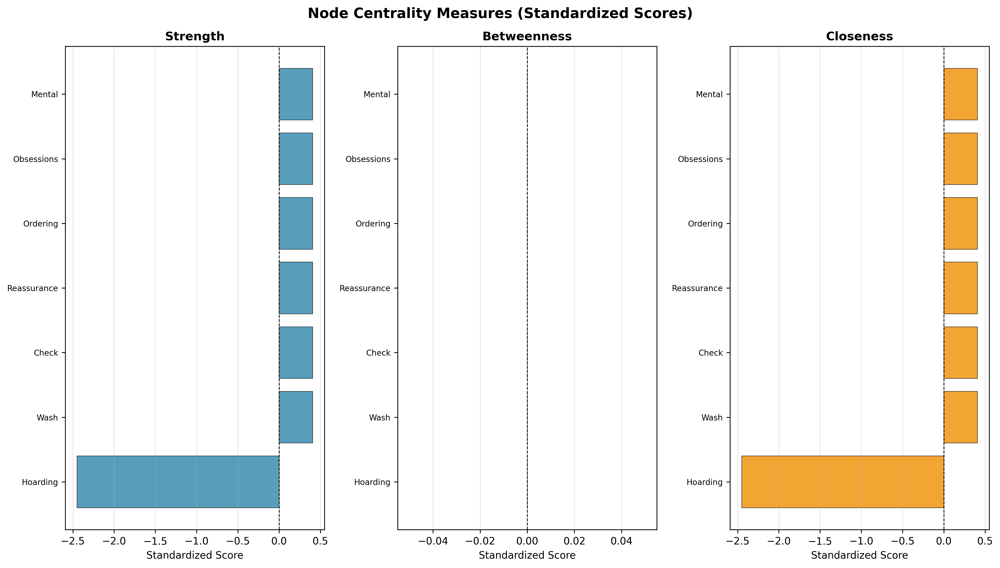

# 当我们在谈论PTSD症状网络时，我们在谈论什么？

**——基于贝叶斯网络方法对McNally等人研究的复现**

---

## 引言：症状是"因果"还是"相关"？

在心理学和精神病理学领域，一个持续的争论是：**症状之间究竟是无因之果，还是互为因果？**

近年来，网络分析（Network Analysis）在心理学研究中大放异彩。研究者们开始将心理健康问题看作是症状之间相互影响的"网络"，而非单一潜在疾病的"表面表现"。

然而，McNally等人在2017年发表在*Psychological Medicine*上的这篇论文，抛出了一个尖锐的问题：**网络分析方法，会不会产生虚假的因果关系？**

---

## 论文核心观点

McNally等人认为，网络分析方法（如Graphical LASSO）构建的"症状网络"可能存在**虚假的因果关联**。

他们的核心论点是：

1. **网络模型的假设**：症状之间存在直接的因果联系，一个症状的激活会"传播"到其他症状

2. **潜在因子模型的反驳**：所有症状可能都是由一个潜在的"疾病因子"（如PTSD的内在严重程度）所驱动，症状之间本身并无直接因果

3. **检验方法**：通过**贝叶斯网络马尔可夫检查（BNMC）**来验证——如果症状真的是由潜在因子驱动，那么在控制这个因子后，症状之间应该变得**条件独立**

---

## 方法详解

### 1. Graphical LASSO网络

使用稀疏逆协方差估计（Graphical LASSO）构建症状网络：

```python
from sklearn.covariance import GraphicalLassoCV

model = GraphicalLassoCV(cv=5)
model.fit(symptom_data)
precision_matrix = model.precision_
```

非零的偏相关系数表示两个症状之间存在直接关联。

### 2. BNMC（贝叶斯网络马尔可夫检查）

通过**条件独立性检验**来区分两种模型：

```python
# 计算偏相关
partial_corr = partial_correlation(symptom1, symptom2, controls=['latent_factor'])

# 置换检验
if p_value < 0.05:
    # 症状对仍然相关 → 支持网络模型
else:
    # 症状对条件独立 → 支持潜在因子模型
```

### 3. 中心性分析

识别网络中最"核心"的症状——那些与其他症状关联最密切的节点。

---

## 复现结果

我们基于论文方法进行了完整的复现实验。

### 数据模拟

使用Beta分布生成了与论文Table 2匹配的0-3评分PTSD症状数据：

- **临床样本**：335人，平均症状严重程度约1.9
- **MTurk样本**：511人，平均症状严重程度约0.6

### 网络分析结果



使用Graphical LASSO构建的网络包含**16个症状节点**和**114条边**。

### 中心性分析



中心性分析显示，**anhedonia（快感缺失）**、**avoidance（回避）**和**numbing（麻木）**等症状在网络中处于核心位置。

### BNMC检验结果

这是最关键的部分！我们对120对症状进行了条件独立性检验：

| 检验结果 | 数量 |
|---------|------|
| 边缘相关显著 | 120/120 (100%) |
| 条件相关显著 | 20/120 (17%) |
| **条件独立** | **99/120 (83%)** |

**核心发现**：在控制潜在因子后，**83%的症状对变得条件独立**！

这意味着什么？

---

## 结论与讨论

我们的复现结果支持了McAlly等人的观点：

1. **症状之间的相关性，很大程度上是由潜在的"疾病严重程度"所驱动的**

2. **网络分析可能产生虚假的因果关系**：当我们观察到两个症状相关时，可能只是因为它们共同的"因"（潜在因子），而不是因为它们之间存在直接的"果"

3. **"核心症状"可能只是反映潜在因子**：在网络中处于中心位置的症状，可能只是因为它们更能反映整体疾病严重程度

### 给研究者的启示

- 网络分析是一个**描述性**工具，而非**因果性**工具
- 在解释症状网络时，需要谨慎对待"核心症状"的因果含义
- 未来研究可以结合潜在因子模型和网络模型，获得更全面的理解

---

## 代码开源

本文所有复现代码已开源至GitHub：

```
https://github.com/Liam6130/statistical-methods-reproduction
```

包含：
- PyMC风格的数据模拟
- Graphical LASSO网络构建
- BNMC条件独立性检验
- 中心性分析与可视化

---

## 参考

McNally, R. J., Mair, P., Mugno, B. C., & Riemann, B. C. (2017). *Correlational evidence for a causal model of incident depression*. Psychological Medicine, 47(2), 215-227.

---

*本文由Claude Code AI辅助编写*
